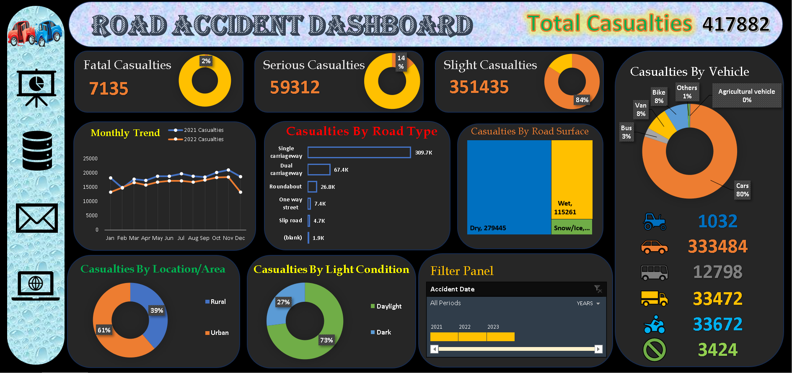

# Road-Accident-Dashboard

Road Accident Dashboard (2021-2022)

Primary KPIs
- Total Casualties: Number of casualties resulting from road accidents
- Casualty Breakdown: Percentage of total casualties by accident severity
- Maximum Casualties by Vehicle Type: Identification of vehicle types involved in the most severe accidents

Secondary KPIs
- Casualties by Vehicle Type: Distribution of casualties across different vehicle types

Insights and Trends
- Monthly Casualty Trend: Comparative analysis of casualties in the current year vs. previous year
- Maximum Casualties in Road Accidents: Identification of the most severe road accidents
- Casualty Distribution by Road Surface: Analysis of casualties by road surface type
- Casualty Patterns by Area/Location and Time of Day: Examination of casualty patterns by geographic location and time of day (day/night)

The stakeholders who can utilize the road accident dashboard include:

Government Agencies:
- Ministry of Transport: Responsible for overseeing transportation policies and regulations ¹ ² ³.
- Road Transport Department: Handles road transport-related matters, such as licensing and vehicle registration ² ⁴.
- Police Force: Enforces traffic laws and regulations.
- Emergency Service Department: Responds to road accidents and provides emergency services.

Safety and Regulatory Bodies:
- Road Safety Vops: Focuses on promoting road safety and reducing accidents.- 
- Transport Operators: Companies or individuals operating transportation services, such as bus or taxi services.

Infrastructure and Management:
Traffic Manage Agencies: Responsible for managing traffic flow and infrastructure.

Public and Media:
- Public: Citizens who use the roads and transportation services.
- Media: News organizations and journalists who report on road accidents and transportation-related issues.

# Steps:-
Data cleaning
custiomized column added
Data analysis and visualization